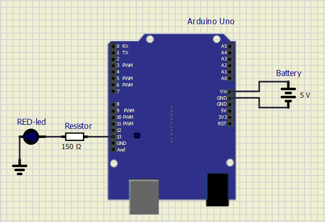

# Lab 1: Filip Nimrichter

Link to my `Digital-electronics-2` GitHub repository:

   [https://github.com/...](https://github.com/FilipNim/Digital_electronics_2/tree/master/Labs)


### Blink example

1. Meaning of the following binary operators in C?
   * `|` or
   * `&` and
   * `^` xor
   * `~` not
   * `<<` left shift
   * `>>` right shift

2. Truth table with operators: `|`, `&`, `^`, `~`

| **b** | **a** |**b or a** | **b and a** | **b xor a** | **not b** |
| :-: | :-: | :-: | :-: | :-: | :-: |
| 0 | 0 | 0 | 0 | 0 | 1 |
| 0 | 1 | 1 | 0 | 1 | 1 |
| 1 | 0 | 1 | 0 | 1 | 0 |
| 1 | 1 | 1 | 1 | 0 | 0 |


### Morse code

1. Repeating one "dot" and one "comma" on a LED:

```c

#define LED_GREEN   PB5 // AVR pin where green LED is connected
#define SHORT_DELAY 250 
#define LONG_DELAY 1000 // Delay in milliseconds
#ifndef F_CPU           // Preprocessor directive allows for conditional
                        // compilation. The #ifndef means "if not defined".
# define F_CPU 16000000 // CPU frequency in Hz required for delay
#endif                  // The #ifndef directive must be closed by #endif


#include <util/delay.h> // Functions for busy-wait delay loops
#include <avr/io.h>     // AVR device-specific IO definitions

int main(void)
{
    // Set pin as output in Data Direction Register
    // DDRB = DDRB or 0010 0000
    DDRB = DDRB | (1<<LED_GREEN);

    // Set pin LOW in Data Register (LED off)
    // PORTB = PORTB and 1101 1111
    PORTB = PORTB & ~(1<<LED_GREEN);
    // Infinite loop
    while (1)
    {
        PORTB = PORTB ^ (1<<LED_GREEN); // 1
        
        _delay_ms(SHORT_DELAY);
         
        PORTB = PORTB & ~(1<<LED_GREEN); // 0
         
        _delay_ms(SHORT_DELAY);
        
        PORTB = PORTB ^ (1<<LED_GREEN); // 1
         
        _delay_ms(LONG_DELAY);
         
        PORTB = PORTB & ~(1<<LED_GREEN); // 0
          
        _delay_ms(SHORT_DELAY);
          
    }

    return 0;
}
```


2. Scheme of Morse code application, i.e. connection of AVR device, LED, resistor, and supply voltage.

   
