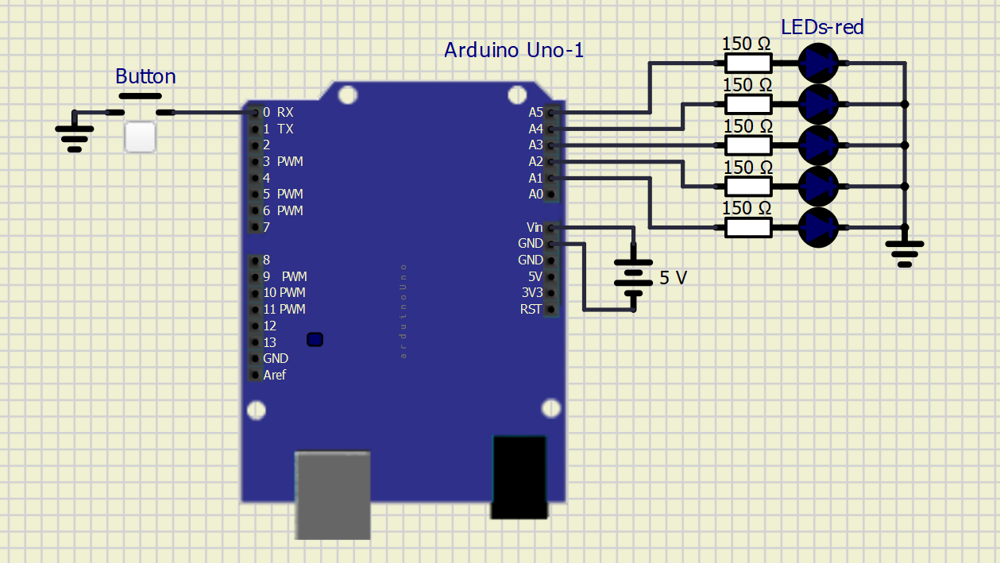

# Lab 2: Filip Nimrichter

Link to your `Digital-electronics-2` GitHub repository:

   [https://github.com/...](https://github.com/FilipNim/Digital_electronics_2/tree/master/Labs/02-leds)


### Active-low and active-high LEDs

1. Complete tables according to the AVR manual.

| **DDRB** | **Description** |
| :-: | :-- |
| 0 | Input pin |
| 1 | Output pin|

| **PORTB** | **Description** |
| :-: | :-- |
| 0 | Output low value |
| 1 | Output high value|

| **DDRB** | **PORTB** | **Direction** | **Internal pull-up resistor** | **Description** |
| :-: | :-: | :-: | :-: | :-- |
| 0 | 0 | input | no | Tri-state, high-impedance |
| 0 | 1 | input | yes| Pxn will source current if ext. pulled low|
| 1 | 0 | Output | no | Output Low (Sink) |
| 1 | 1 | Output | no | Output High (Source) |

2. Part of the C code listing with syntax highlighting, which blinks alternately with a pair of LEDs; let one LED is connected to port B and the other to port C:

```c
int main(void)
{
    // Green LED at port B
    // Set pin as output in Data Direction Register...
    DDRB = DDRB | (1<<LED_GREEN);
    // ...and turn LED off in Data Register
    PORTB = PORTB & ~(1<<LED_GREEN);

    // Configure the second LED at port C
    DDRC = DDRC | (1<<LED_WHITE);
    
    PORTC = PORTC & (1<<LED_WHITE);
 
    


    while (1)
    {
        // Pause several milliseconds
        _delay_ms(BLINK_DELAY);

        PORTB = PORTB ^ (1<<LED_GREEN);
        PORTC = PORTC ^ (1<<LED_WHITE);
    }

    // Will never reach this
    return 0;
}
```
### Push button

1. Part of the C code listing with syntax highlighting, which toggles LEDs only if push button is pressed. Otherwise, the value of the LEDs does not change. Let the push button is connected to port D:

```c
    DDRD = DDRD & ~(1<<BUTTON);

    PORTD = PORTD | (1<<BUTTON);


	 while (1)
	 {    
		 if (bit_is_clear(PIND, BUTTON)) {
			 
			 _delay_ms(BLINK_DELAY);
			 PORTB = PORTB ^ (1<<LED_GREEN);
			 PORTC = PORTC ^ (1<<LED_WHITE);
			loop_until_bit_is_set(PIND, BUTTON); 
			
			 
		 }
	 }
```


### Knight Rider

1. Scheme of Knight Rider application, i.e. connection of AVR device, five LEDs, resistors, one push button, and supply voltage. The image can be drawn on a computer or by hand. Always name all components and their values!

   
